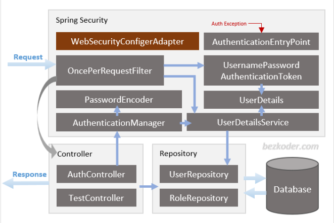
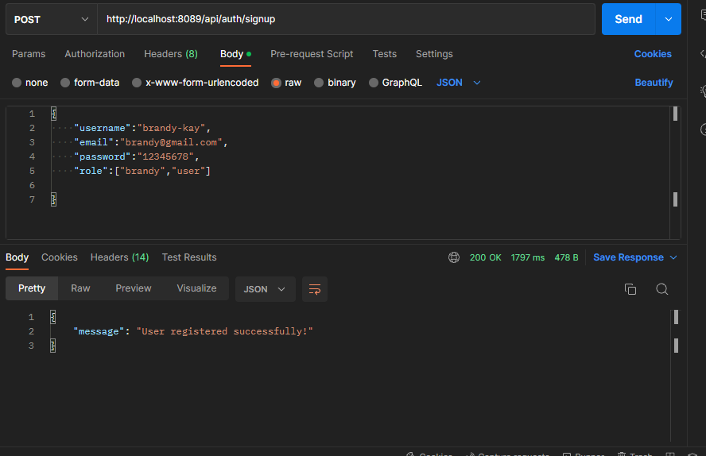

# JWTAuthentication
This is a spring boot application that supports token based authentication with JWT, it covers the following concepts

- Flow for user signup and signin with JWT Authentication
- Spring boot application architecture with spring security
- Data models definitions
- Using spring data JPA to interact with `MySQL` database

This application runs on `MySQL` database and the `RESTApi` are tested on postman.

#### Endpoint provided
| methods 	| Urls 	| actions 	|
|---	|---	|---	|
| POST 	| /api/auth/signup 	| signup new account 	|
| POST 	| /api/auth/signin 	| signin user to created account 	|
| GET 	| /api/test/all 	| retrive public contents 	|
| GET 	| /api/test/user 	| accesses user content 	|
| GET 	| /api/test/mod 	| accesses moderator content 	|
| GET 	| /api/test/admin 	| accesses admins content 	|

### Getting Started

### Spring Security
Here is the spring boot server diagram how the process flows.

### Technology Used
- java8
- Spring boot2 (with spring security.Spring web Spring Data JPA)
- jjwt 0.9.1
- MySQL
- Gradle

### Demo
Postman test for Sign up

Postman test for Sign in

### Reference Documentation
For further reference, please consider the following sections:

* [Official Gradle documentation](https://docs.gradle.org)
* [Spring Boot Gradle Plugin Reference Guide](https://docs.spring.io/spring-boot/docs/2.7.5/gradle-plugin/reference/html/)
* [Create an OCI image](https://docs.spring.io/spring-boot/docs/2.7.5/gradle-plugin/reference/html/#build-image)
* [Spring Data JPA](https://docs.spring.io/spring-boot/docs/2.7.5/reference/htmlsingle/#data.sql.jpa-and-spring-data)
* [Spring Security](https://docs.spring.io/spring-boot/docs/2.7.5/reference/htmlsingle/#web.security)

### Guides
The following guides illustrate how to use some features concretely:

* [Accessing Data with JPA](https://spring.io/guides/gs/accessing-data-jpa/)
* [Accessing data with MySQL](https://spring.io/guides/gs/accessing-data-mysql/)
* [Securing a Web Application](https://spring.io/guides/gs/securing-web/)
* [Spring Boot and OAuth2](https://spring.io/guides/tutorials/spring-boot-oauth2/)
* [Authenticating a User with LDAP](https://spring.io/guides/gs/authenticating-ldap/)

### Additional Links
These additional references should also help you:

* [Gradle Build Scans – insights for your project's build](https://scans.gradle.com#gradle)

### Support
- Found this project useful ❤️? Support by clicking the ⭐️ button on the upper right of this page. ✌️
- Notice anything else missing? File an issue
- Feel free to contribute in any way to the project from typos in docs to code review are all welcome.
